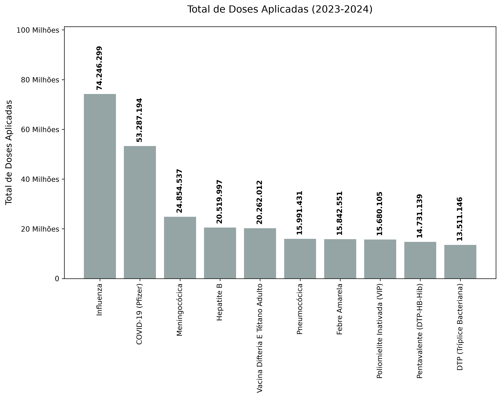
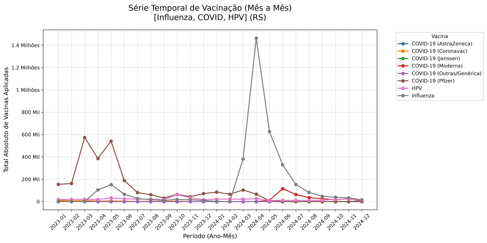
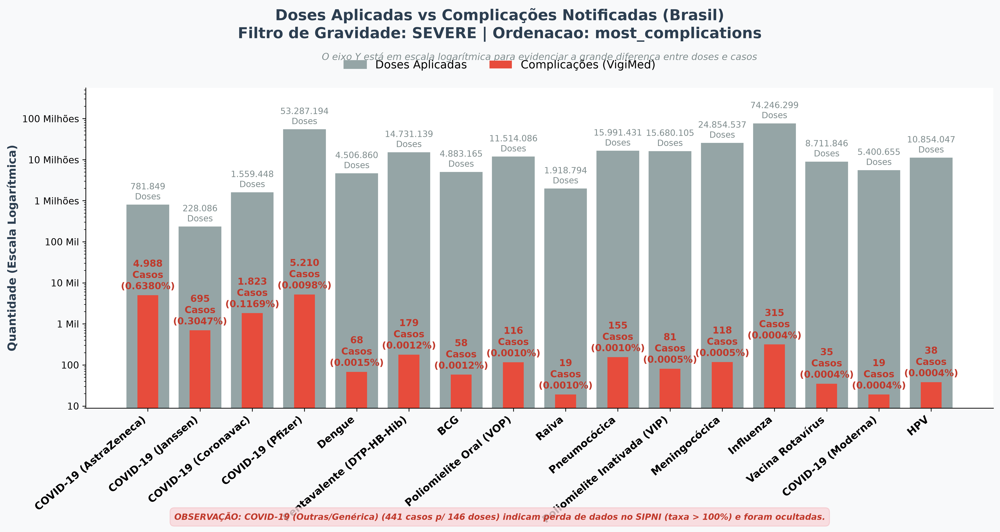
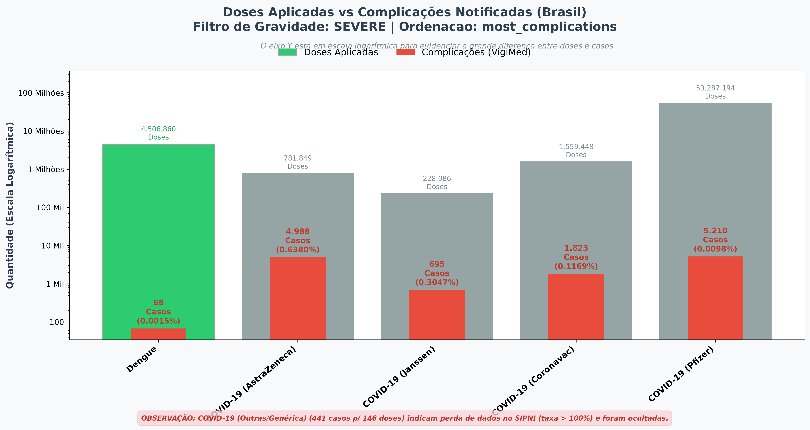
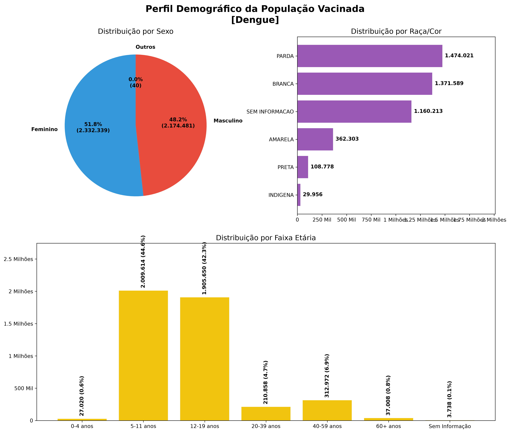

# VaccineGraph - Análise Avançada de Vacinação no Brasil

**Autor:** Piero Motta Bonfada (bpiero@gmail.com)

O **VaccineGraph** é uma poderosa ferramenta de linha de comando (`vacinas_cli.py`) projetada para cruzar e analisar gigabytes de dados reais do Sistema Único de Saúde do Brasil (DATASUS/SI-PNI) e da Agência Nacional de Vigilância Sanitária (VigiMed). 

A ferramenta utiliza processamento otimizado *out-of-core* com DuckDB e Pandas, permitindo que análises cruzadas complexas de centenas de milhões de doses aplicadas com milhares de reações adversas graves sejam realizadas em segundos, sem a necessidade de um supercomputador.

---

## Casos de Uso e Funcionalidades

O CLI é altamente modular. Aqui estão alguns dos principais cenários suportados nativamente:

### 1. Ranking de Doses Aplicadas no Brasil
Quais foram as vacinas mais aplicadas no país em um determinado intervalo de tempo?
Comando utilizado para buscar o **Top 10** nacional entre 2023 e 2024:
```bash
./vacinas_cli.py --chart doses \
    --start-year 2023 --end-year 2024 \
    --top 10 -o ex_doses_brasil.png
```


---

### 2. Linha do Tempo Mensal (Destaque e Filtro Regional)
Exibir a evolução temporal (meses) em que determinadas vacinas (ex: Gripe/Influenza, COVID e HPV) foram aplicadas, isolando os dados de um estado específico (Ex: Rio Grande do Sul). O programa compila de forma inteligente todos os meses dentro do intervalo de anos informado.
```bash
./vacinas_cli.py --chart monthly \
    --start-year 2023 --end-year 2024 \
    --state RS --search Influenza COVID HPV \
    -o ex_mensal_rs.png
```


---

### 3. Cruzamento de Complicações (Busca Dinâmica com `--until`)
Ao invés de limitar o gráfico a um top "N" fixo, o usuário pode pedir para listar as vacinas na ordem da que gera **mais complicações (%)** até chegar na vacina alvo (ou alvos), independente de quão longa seja a lista.

O motor analisa todas as vacinas, ordena da mais frequente para a menos frequente e encontra a posição final de `HPV` ou `Influenza` (a que estiver mais longe), plotando todas até aquele ponto. 
*(Observação: Neste modo dinâmico, as barras obedecem sua coloração e ordenação naturais).*
```bash
./vacinas_cli.py --chart complications \
    --severity severe --sort most_complications \
    --start-year 2023 --end-year 2024 \
    --until HPV Influenza -o ex_complicacoes_until.png
```


---

### 4. Destaque Forçado em um Top Limitado (Busca Fixa com `--search`)
Quando queremos gerar um gráfico com um número restrito e amigável para apresentações (ex: Top 5 de complicações graves) mas **precisamos** garantir que uma vacina alvo (ex: Dengue) apareça e chame a atenção da audiência.

O programa extrai o Top natural, e se a `Dengue` não estiver nele, ele **força** a presença dela e a **colore de verde** (junto com o respectivo texto numérico) para evidenciar a comparação de forma didática.
```bash
./vacinas_cli.py --chart complications \
    --severity severe --sort most_complications \
    --start-year 2023 --end-year 2024 \
    --top 5 --search Dengue -o ex_complicacoes_search_dengue.png
```


---

### 5. Perfil Demográfico Profundo
Descreve em riqueza de detalhes estatísticos o perfil do paciente que recebe a vacina pesquisada (Sexo, Raça/Cor e Faixa Etária).
```bash
./vacinas_cli.py --chart profile \
    --start-year 2023 --end-year 2024 \
    --search Dengue -o ex_perfil_dengue.png
```


---
## Segurança Metodológica Avançada
- **Desmembramento de Fabricantes:** Subtipos da COVID-19 (Pfizer, AstraZeneca, Janssen, Coronavac, Moderna) são rastreados e desmembrados automaticamente cruzando strings literais nas duas bases diferentes, impossibilitando anomalias de aglomeração estatística.
- **Sanity Checks (Filtros de Perda de Dados):** Se a taxa de evento grave exceder 100% devido a perdas de registro de denominador no SIPNI (comum em reportes "Genéricos" no VigiMed), a vacina é excluída da plotagem e um alerta justificado metodologicamente é gerado no rodapé do gráfico.

**Desenvolvido em Python | DuckDB | Pandas | Matplotlib**

**Regras para propostas de commit: source e comentários: english only! Output para o usuário: portugues apenas!**
